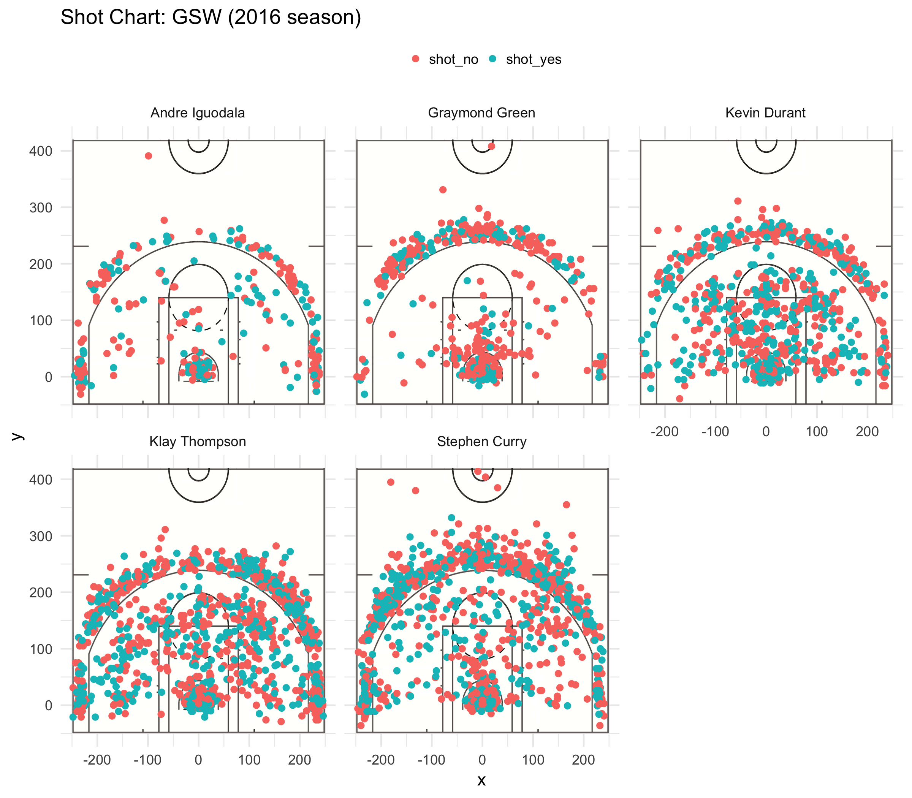

#Five GSW players : Iguodala, Green, Durant, Thompson, and Curry. Who has the best shooting accuracy?


##Data
Andre Iguodala has the most shooting accuracy for 2-point
His shooting success shooting rate is above 63%

###2PT Effective Shooting % by Player
```{r}
library(dplyr)
datafile <- "../data/shots-data.csv"
dat <- read.csv(
  datafile
)

two_eff <- summarise(
  group_by(dat,name),
  total = length(shot_type[shot_type 
                 == "2PT Field Goal"]),
  made = length(shot_made_flag[shot_made_flag == 'shot_yes' & shot_type =='2PT Field Goal']),
  perc_made = made/total*100
  )

two_eff <- arrange(two_eff,-perc_made)

two_eff
```

Klay Thompson has the most shooting accuracy for 3-point
His shooting success shooting rate is above 42%

####3PT Effective Shooting % by Player
```{r}
three_eff <- summarise(
  group_by(dat,name),
  total = length(shot_type[shot_type 
                 == "3PT Field Goal"]),
  made = length(shot_made_flag[shot_made_flag == 'shot_yes' & shot_type =='3PT Field Goal']),
  perc_made = made/total*100
  )

three_eff <- arrange(three_eff,-perc_made)

three_eff
```


####Total Effective Shooting % by Player
```{r}
total_eff <- summarise(
  group_by(dat,name),
  total = length(shot_made_flag),
  made = length(shot_made_flag[shot_made_flag == "shot_yes"]),
  perc_made = made/total*100
  )

total_eff <- arrange(total_eff,-perc_made)
total_eff
```

Klay Thompson has more 3-points accuracy than Stephen Curry. Most of people thinks that Curry is the best 3-points player in GSW but by the stat, it is not true.


####GSW shooting charts
```{r out.width='80%', echo = FALSE, fig.align = 'center'}

```

